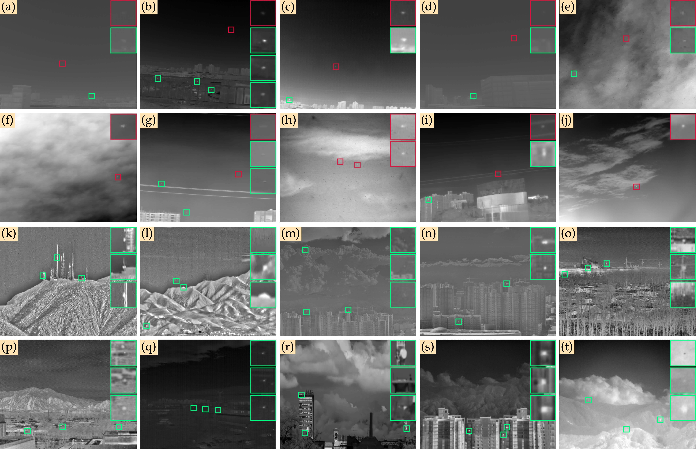
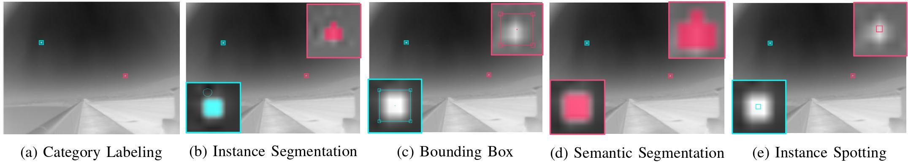

Single-frame InfraRed Small Target-V2 (SIRST-V2) Benchmark
==============

A dataset proposed in "One-Stage Cascade Refinement Networks for Infrared Small Target Detection"

## Dataset Description

SIRST-V2 is a dataset specially constructed for **single-frame** infrared small target detection, in which the images are selected from thousands of infrared sequences for different scenarios. 



<!--  -->

Annotation formats available:

- bounding box;
- semantic segmentation;
- normalized contrast (produced when data loading).


## Citation

Please cite our paper in your publications if our work helps your research. BibTeX reference is as follows.

```
@article{TGRS23OSCAR,
  author    = {Yimian Dai and Xiang Li and Fei Zhou and Yulei Qian and Yaohong Chen and and Jian Yang,
  title   = {{One-Stage Cascade Refinement Networks for Infrared Small Target Detection}},
  journal = {IEEE Transactions on Geoscience and Remote Sensing},
  pages   = {1--17},
  year    = {2023},
}

@inproceedings{dai21acm,
  title   =  {Asymmetric Contextual Modulation for Infrared Small Target Detection},
  author  =  {Yimian Dai and Yiquan Wu and Fei Zhou and Kobus Barnard},
  booktitle =  {{IEEE} Winter Conference on Applications of Computer Vision, {WACV} 2021}
  year    =  {2021}
}

@article{TGRS21ALCNet,
  author    = {{Dai}, Yimian and {Wu}, Yiquan and {Zhou}, Fei and {Barnard}, Kobus},
  title   = {{Attentional Local Contrast Networks for Infrared Small Target Detection}},
  journal = {IEEE Transactions on Geoscience and Remote Sensing},
  pages   = {1--12},
  year    = {2021},
}
```

